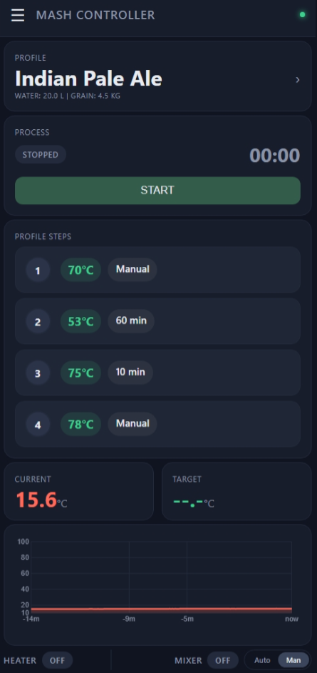
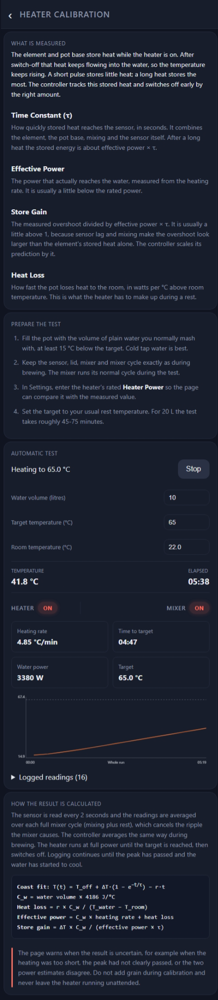
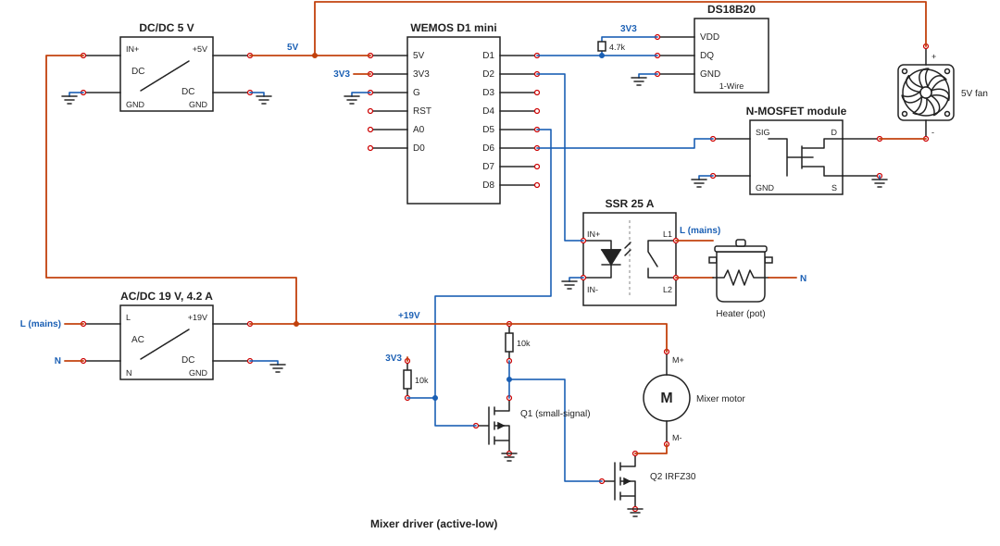

# MashController

MashController is a home brewing automation project built to control the mash process with a small ESP8266-based controller. The goal is to make mash temperature easier to manage, more stable, and less dependent on constant manual intervention.

This project is designed for a brewer who wants a simple device that can measure temperature, control a heater, run a mixer, and expose a browser-based interface for monitoring and calibration.

## Safety Notice

This project is intended for educational and hobby use.

The software is provided without any warranty. Users are responsible for verifying that the system operates safely in their specific environment.

The author accepts no responsibility for any damage, injury, material loss, or other consequences resulting from the use of this project.

By using this software, you acknowledge that all operation is performed at your own risk.

## What this project does

During mashing, the temperature must stay within a fairly narrow range to support the desired enzymatic activity and conversion. MashController helps by continuously monitoring the mash temperature and adjusting the heating output to keep it near the target value. It also manages the mixer so the mash stays well mixed and the temperature remains consistent throughout the vessel.

## Heater temperature control logic

The heater control is based on temperature feedback. The controller reads the current temperature from the sensor, compares it to the configured target temperature, and then switches the heater on or off depending on whether the mash is below or above the desired range.

The logic is designed to reduce overshoot and avoid excessive switching by using a small control band and tuned thresholds. In practice, this means the heater will turn on when the mash drops below the target range and turn off once the temperature is back within the desired operating window. This keeps the mash temperature stable enough for a predictable and repeatable mash. The heater also keeps releasing stored heat after it is switched off, so the controller uses the values from the [heater calibration](#heater-calibration) to switch off slightly early.

## Mixer logic

The mixer logic is intended to keep the mash moving while the heater is active. A mash can develop temperature gradients, especially in a vessel with a heating element near the bottom, where the liquid close to the heater becomes warmer than the rest. The mixer helps prevent that by circulating the mash and blending warmer and cooler zones together.

This improves consistency, reduces hot spots, and helps the system hold a more uniform temperature across the vessel.

## Profiles

A profile is a complete mash schedule: a list of temperature steps (up to 6), each with a target temperature and a duration. Up to 15 profiles can be stored on the device. They are edited on the Profiles screen and started from the Home screen, where the active step and remaining time are shown.

A step with its time set to 0 is a manual step: the controller heats to the target temperature and then waits until you press RESUME, for example to add grain. While a profile runs it can be paused, resumed, skipped to the next step or stopped. After the last step the mixer keeps running for a configurable cool-down time. Profiles cannot be edited while a process is running.

When a manual step reaches its target temperature, the browser plays a soft chime, repeats it every 20 seconds until you press RESUME or STOP, and flashes the tab title. Browsers block sound until the page has been tapped once (for example after a refresh), so a yellow bar appears while a process is running to let you enable it. The alert can be switched off in Settings (**Sound Alerts**), and **Target Reached Tolerance** sets how many degrees below the target still counts as reached.

## Heater calibration

The DS18B20 sensor is factory-calibrated, so the sensor itself is not calibrated. What is calibrated is the **heater**. The element and pot base store heat, which keeps flowing into the water after switch-off, so the temperature overshoots. An automatic test on plain water (see the calibration page) measures the time constant (τ), effective power, store gain and heat loss of your setup, and the controller uses them to switch off early by the right amount.

### Why not PID?

A PID controller works well when the output can be varied smoothly and the process responds quickly. Here the heater is switched fully on or off, and the response is slow and delayed: stored heat in the element and pot base, the sensor lag and the mixer cycle all postpone the effect of any change. With that much lag the integral term winds up and the loop overshoots or oscillates remarcably. A model of the stored heat, fitted from a real calibration run, predicts the overshoot directly and gives a more repeatable result.

> **Safety:** never leave the heater running unattended during calibration, and do not add grain.

## Features

- Temperature regulation for the mash process
- Heater control based on live sensor feedback
- Mixer control to keep the mash evenly mixed
- Mash profiles with up to 6 temperature steps each, including manual (wait for RESUME) steps, and up to 15 stored profiles
- Pause, resume and skip controls while a profile is running
- Audible browser alert when a manual step reaches its temperature
- Browser-based dashboard for monitoring and configuration
- Automatic heater calibration (time constant, effective power, store gain, heat loss)
- OTA (Over-the-Air) update support

## Screenshots

<table>
  <tr>
    <td valign="top" align="center">
       
      <b>Main Dashboard</b>
    </td>
    <td valign="top" align="center">
       
      <b>Heater Calibration</b>
    </td>
  </tr>
</table>

## Hardware

The wiring diagram below shows how the Wemos D1 mini is connected to the sensor, heater, mixer and cooler.

  

### Parts

- Wemos D1 mini (ESP8266)
- DS18B20 temperature sensor with a 4.7 kΩ pull-up resistor to 3V3
- Solid-state relay (SSR), 25 A, for the heater (mains side)
- Heater element in the mash pot
- 19 V / 4.2 A AC/DC power adapter (notebook adapter)
- Buck (DC/DC) converter, 19 V to 5 V, for the Wemos and the fan
- Mixer driver: small-signal N-MOSFET (Q1) pulling down the gate of an IRFZ30 (Q2), with a 10 kΩ gate pull-up to the 19 V rail
- 10 kΩ pull-up from D5 to 3V3, so the mixer stays off while the ESP8266 boots
- DC mixer motor
- 5 V cooling fan for the SSR, switched by a second N-MOSFET module

### Pin assignment

| Function | Wemos pin | Connected to |
| --- | --- | --- |
| `ONE_WIRE_BUS` | D1 | DS18B20 data (DQ) |
| `HEATER_PIN` | D2 | SSR input (IN+) |
| `MIXER_PIN` | D5 | Q1 gate (active-low: GPIO LOW = mixer on) |
| `COOLER_PIN` | D6 | Fan MOSFET module (SIG) |

The pins are defined in `Config.h`.

> **Warning:** the SSR switches mains voltage. Mount it on a heatsink, use a properly rated and enclosed installation, and never work on the mains wiring while it is connected to power. A flyback diode across the motor and the fan is recommended; it is not drawn in the schematic.

## Getting Started

1. Clone the repository.
2. Open the project in [PlatformIO](https://platformio.org/).
3. Build and upload the firmware to your ESP8266 board.
4. Upload the filesystem image using PlatformIO ("Build Filesystem Image" and "Upload Filesystem Image").
5. Connect to the device’s AP and open `http://192.168.4.1` in a browser (the default IP address of the Wemos in AP mode). Configure the wifi password in the settings.
6. Run Autocalibration for your heater setup.

## License

This project is licensed under the MIT License.
